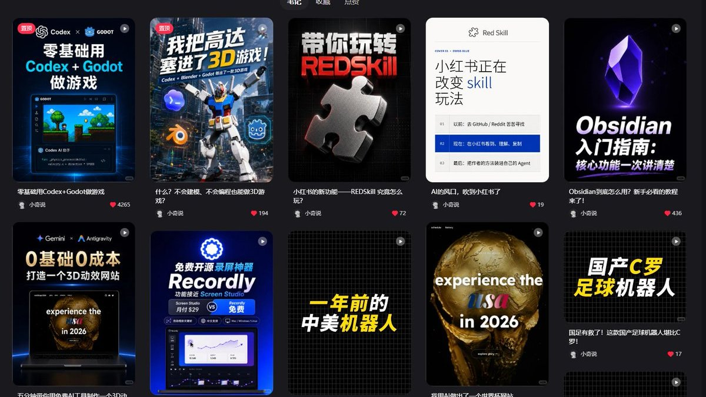

# Video CoverCraft · 视频封面工坊

根据视频脚本、视频描述或封面描述制作封面与完整提示词，支持常规或创意风格、参考图、中文标题、横竖画幅和可选人物；也可仅交付提示词、反推已有图或诊断旧封面。

A video-cover skill for AI agents. Turn a script, video summary, or visual brief into a cover and a portable prompt. Choose regular or creative styles, request prompts only, describe an existing cover, or diagnose and redesign it. Supports reference images, exact Chinese headlines, landscape/portrait layouts, and optional people.

当前版本 **2.17.0**。

## 快速交付与完整预览

主流程按任务加载细则，普通制作默认快速交付；需要完整文件或列表比较时再增加预览，不多问一道深度选择题。

| 深度 | 适合怎么用 | 交付与检查 |
| --- | --- | --- |
| **快速交付（默认）** | 「做一张封面」或「快速交付」 | 原图或指定格式、完整提示词（仅图片时省略）、简短检查说明；查看原图和约 320px 小图，核对中文、主体、人物、画幅和边缘 |
| **完整预览** | 「完整预览」「给列表预览」或「做缩略图对比」 | 保留核心验图，增加 PNG/JPEG、缩略图对比页、浅/深列表、320/168/120px、模拟遮挡与裁切检查 |

可以在下方任一制作示例末尾加「快速交付即可」或「请完整预览，给格式导出与列表对比」。只要一种格式或一个附件时按要求补足。两种深度都支持常规或创意风格；「只要提示词」仍只交付文字，不因完整预览自动生图。未实际查看的项目会如实标明。

[核心验收与预览细则](video-cover-craft/references/text-and-preview-review.md) · [图片交付与导出](video-cover-craft/references/gpt-image-workflow.md)

## 常规风格与创意风格

| 创作方式 | 如何设计 | 如何检查 |
| --- | --- | --- |
| **当前基础风格（常规）** | 借鉴 AI 博主的主题表达、信息层级和主体尺度；字体、颜色、材质按内容调整 | 核对选取的表达特征、用户明确保留项与本期内容 |
| **创意风格** | 从表达结构延展，或从内容探索新构图与主体比喻；重新设计字体、配色和材质 | 按本轮设计目标和锁定项检查，允许变化的外观可以偏离旧样图 |

制作新封面或完整提示词时，**未说明创作方式会主动澄清**，与尚缺的画幅、人物合并问一次：

```text
这次按当前基础风格（常规）生成，还是用创意风格重新设计？
基础风格：借鉴现有样图的表达结构，按本期内容调整。
创意风格：重新构思构图和主视觉，字体、配色、材质也可重新设计。
```

已说基础/创意、选定内置风格或授权「风格你决定」时不重复问；仅指定参考图、颜色或材质不自动替你选方式。局部修改、已有图提词、只诊断、浏览或拟标题不新增此问。两种方式都支持图片或仅提示词；创意延展/探索由 Agent 判断，不追加子模式问题。B01–B10 和旧风格名称继续可用。

说「这些风格全部不喜欢」时，会退出当前推荐，从内容重新构思，沿用已确定的文案、画幅、人物与必要素材，避开本轮拒绝项。只要一张仍只做一套；只要求改字体、颜色或字号时，按对应范围调整。用户明确限定常规风格时，继续在常规范围重选结构。反馈只有在用户明确要求长期记住时才保存为账号偏好。

无论采用哪种方式，实际生图后仍检查内容、逐字中文、人物、画幅和小图可读性。创意探索可以不使用旧风格图；需要保留真实人物身份、准确产品或软件界面时，仍须提供对应素材。详见 [创作方式与反馈处理](video-cover-craft/references/creation-modes.md)。

```text
$video-cover-craft
视频描述：用 AI 把零散会议记录整理成行动清单。
封面主标题逐字写「开完会，谁来做？」。
请用创意风格，重新设计构图、字体和材质。
横版 16:9，无人物，只要一套完整提示词，风格你决定。
```

## 图片、提示词与旧图诊断

普通「做封面」默认交付图片及对应的完整可移植提示词；「只要提示词」直接交付文字，不调用生图或 API。普通风格参考会展开为具体描述，复制到其他生图 AI 时无需附带技能图库；必须保留真实身份或精确界面时会列出必要素材。跨模型可能改变排版、中文准确性和细节，不保证逐像素复现。

「反推这张图的提示词」根据实际图片写近似复现描述；「诊断这张封面」给设计评审、修改顺序和完整改版提示词，默认不生图。明确要求重做时再生成改版。视频标题与封面文字分开记录，指定文案逐字采用，没有视频标题仍可继续。

[提示词交付](video-cover-craft/references/prompt-export.md) · [旧封面诊断](video-cover-craft/references/cover-diagnosis.md) · [标题与封面配合](video-cover-craft/references/title-cover-alignment.md)

## 先看图，再选风格

不知道风格长什么样，可以先打开 [18项风格的图文菜单](video-cover-craft/references/style-menu.md)。下载完整技能后，也可打开 [离线风格图库](video-cover-craft/style-picker.html)：按内容类型搜索，点选卡片，复制一条短句发给 Agent。

先澄清基础/创意；选基础但未定具体样式时可推荐最多三种真实样图。已要求先看样图时，在展示推荐的同一轮提供基础/创意选项，选 B 样图即可，不拆成两轮。离线菜单提供「常规风格」「创意风格」「这些都不喜欢 · 探索新方向」，点击后复制选择句发给 Agent。已要求创意探索或全部不满意时不重复原菜单；仅提示词不强制浏览图库。已定具体风格或参考不重复开菜单，但参考图本身不代替创作方式选择。每种风格都可用横竖版、有人物或无人物。

例如：`先给我看看适合 AI 编程教程的风格，我选完再生成。` 看过后回复：`B02，竖版，无人物。` 只想浏览风格，不必先准备完整视频脚本。

## 真实 AI 生图案例

本页共展示 **34 张实际生成的 AI 主题封面**，可点击查看 PNG 原图。其中 10 张对应全部 10 种基础风格：5 张原创人物、5 张无人物，横竖各 5 张；另有 8 张 S01–S08 特定风格样图，以及此前 16 张案例。主题为虚构案例，界面、论文、修复结果与模型回答均为示意。2.17.0 新增 8 张独立生成样图；2.11.0–2.16.0 的流程与参考升级保留。

### 10 种基础风格的真实样张

[可筛选图库与提示词](examples/integrated-styles-v3/README.md) · [逐张来源与验图](video-cover-craft/references/style-validation.md)

#### 竖版 · 3:4

| B01 黄蓝冲击 | B03 白橙清单 | B05 极简编辑 |
| --- | --- | --- |
| <a href="video-cover-craft/assets/style-examples/01-b01-ai-weekly.png"></a> | <a href="video-cover-craft/assets/style-examples/03-b03-ai-paper.png"></a> | <a href="video-cover-craft/assets/style-examples/05-b05-ai-handoff.png"></a> |

| B08 未来办公 | B10 立体概念 |
| --- | --- |
| <a href="video-cover-craft/assets/style-examples/08-b08-ai-office.png"></a> | <a href="video-cover-craft/assets/style-examples/10-b10-ai-knowledge.png"></a> |

#### 横版 · 约 16:9

| B02 蓝黑科技 | B04 彩色漫画 | B06 发布会实测 |
| --- | --- | --- |
| <a href="video-cover-craft/assets/style-examples/02-b02-ai-editing.png"></a> | <a href="video-cover-craft/assets/style-examples/04-b04-ai-prompt.png"></a> | <a href="video-cover-craft/assets/style-examples/06-b06-ai-coding.png"></a> |

| B07 双阵营对比 | B09 矩阵控制室 |
| --- | --- |
| <a href="video-cover-craft/assets/style-examples/07-b07-ai-models.png"></a> | <a href="video-cover-craft/assets/style-examples/09-b09-ai-agents.png"></a> |

10 张样图的原图与 320px 小图检查记录见上述链接。30 个分支完成来源与设计规则整合，其中 10 个分支有实图验证；其余 20 个尚未逐个生图。2.11.0 的常规、创意、整体拒绝后探索及局部反馈流程完成了文本场景检查，尚未额外生图验证创意效果。

### 此前的 AI 主题案例

### 横版 · 16:9

| AI 做 PPT · B08 未来办公 | AI 编程 · B06 发布会实测 | AI 多模型对比 · B07 双阵营对比 |
| --- | --- | --- |
| <a href="examples/ai-topics-v2/images/02-ai-ppt.png"></a> | <a href="examples/ai-topics-v2/images/05-ai-code.png"></a> | <a href="examples/ai-topics-v2/images/06-ai-models.png"></a> |
| 无人物 | 原创虚拟人物 | 无人物 |

### 竖版 · 3:4

| AI 办公挑战 · B01 黄蓝冲击 | AI 读论文 · B03 白橙清单 | AI 修复照片 · B10 立体概念 |
| --- | --- | --- |
| <a href="examples/ai-topics-v2/images/01-ai-office.png"></a> | <a href="examples/ai-topics-v2/images/03-ai-paper.png"></a> | <a href="examples/ai-topics-v2/images/04-ai-restore.png"></a> |
| 原创虚拟人物 | 原创虚拟人物 | 无人物 |

[查看六个选题、设计依据和实际提示词](examples/ai-topics-v2/README.md)。这六个案例展示了六种风格，完整基础风格库共 10 种；上方新样张覆盖全部 10 类，30 个分支不代表均已实测。

### 更多 AI 风格案例

以下 6 张为此前生成的 AI 工作搭档、资料整理、知识库及 AI 开发流程案例，包含原创虚拟人物与无人物版本。标注的风格名称用于说明本张视觉方向；参考延展不另计为基础风格。

| AI 工作搭档 · 黄蓝冲击 | AI 知识库 · 彩色漫画 | ChatGPT → Codex · 冷暖接力 |
| --- | --- | --- |
| <a href="examples/images/01-yellow-blue-presenter.png"></a> | <a href="examples/images/04-color-comic-no-person.png"></a> | <a href="examples/images/06-cold-warm-presenter.png"></a> |
| 横版 · 原创人物 | 横版 · 无人物 | 横版 · 原创人物 |

| AI 开发流程 · 蓝黑科技 | AI 资料整理 · 白橙清单 | AI 开发需求 · 极简编辑 |
| --- | --- | --- |
| <a href="examples/images/02-blue-tech-no-person.png"></a> | <a href="examples/images/03-white-orange-presenter.png"></a> | <a href="examples/images/05-minimal-no-person.png"></a> |
| 竖版 · 无人物 | 竖版 · 原创人物 | 竖版 · 无人物 |

[查看这组案例的内容与生成提示词](examples/README.md)。

### Codex 额度主题 · 四种视觉方案

同一主题采用深蓝设备工作流、冷暖接力、清爽任务清单与漫画对照。均为无人物竖版；冷暖接力采用修改后的副标题「省额度小技巧」。

| 蓝黑科技 · 先讨论再开发 | 冷暖接力 · 省额度小技巧 |
| --- | --- |
| <a href="examples/codex-quota/images/01-blue-workflow.png"></a> | <a href="examples/codex-quota/images/02-cold-warm-quota-tip.png"></a> |

| 清爽清单 · 开发说明 | 彩色漫画 · 两种开发方式 |
| --- | --- |
| <a href="examples/codex-quota/images/03-clean-checklist.png"></a> | <a href="examples/codex-quota/images/04-comic-comparison.png"></a> |

[查看四张原图与实际提示词](examples/codex-quota/README.md)。

## 能做什么

- **三种输入任选一种**：完整脚本、视频内容简介，或直接描述想要的封面画面；也可以组合。
- **参考图与风格延展**：10种AI基础风格、30个基础分支、8种截图特定风格、41个用户参考档案；配色可按内容自由变化。
- **常规与创意路线**：按用户意图选择结构延展或内容探索；全部不喜欢时重新构思，保留已确定设置。
- **完整可移植提示词**：默认逐图交付，也可只要提示词或基于已有图提词；普通风格描述不依赖图库附件。
- **旧图诊断与改版**：查看实际图片，给设计评审和修改顺序；用户要求改图时再生成。
- **主动澄清制作选择**：基础/创意、画幅、人物只补实际缺项，合并问一次，不要求本人出镜。
- **GPT Image 优先**：不可用时使用平台自带生图工具；也支持用户自行配置并明确选用 OpenAI 图片 API。
- **两种交付深度**：默认快速交付原图、提示词与检查说明；完整预览增加格式导出、对比页与列表检查，两种都保留核心验图。
- **按本轮目标验收**：区分锁定、继承和重新设计项，结合内容与标题检查；仅提示词不冒称像素验收通过。

Skill 的完整入口在 [video-cover-craft/SKILL.md](video-cover-craft/SKILL.md)，使用条件和工具能力以宿主提供的实际工具为准。

## 10 种 AI 基础风格

| 编号 / 名称 | 独立的视觉结构 | 适用的 AI 内容 | 配色与标题起点 |
| --- | --- | --- | --- |
| B01 黄蓝冲击 | 大字、强色块、单一夸张动作或对象 | AI 工具亮相、办公挑战、功能变化 | 黄蓝或柠檬紫墨；粗斜字与明确描边 |
| B02 蓝黑科技 | 深色设备空间、透视、重点光域与工作流 | AI 编程、软件教程、自动化 | 蓝黑青白或深绿暖金；白色粗标题 |
| B03 白橙清单 | 浅底、层次清楚的任务卡和功能图标 | AI 技能列表、论文整理、步骤说明 | 白橙或晨雾薄荷；黑色粗字、重点条 |
| B04 彩色漫画 | 漫画轮廓、分格、问题与解法或夸张比喻 | AI 误区、功能讲解、模型概念 | 有限明亮色块；漫画轮廓字 |
| B05 极简编辑 | 大留白、单一 AI 工具或成果、一句观点 | AI 经验复盘、提示词、方法观点 | 中性色与一个重点色；编辑式标题 |
| B06 发布会实测 | 摄影工作室、主展示对象、体验或问答标题 | AI 新功能体验、工具评测、发布解读 | 炭黑暖金或灰蓝银白；粗斜标题与一处版本重点 |
| B07 双阵营对比 | 同等视觉重量的两区、共同任务与比较对象 | 两模型、两工具、两种 AI 做法的对比 | 冷暖或两套可区分色；两方名与一个主问题 |
| B08 未来办公 | 统一空间内的环幕、悬浮设备、成果舞台 | AI 办公、PPT、文档、Agent 协作 | 蓝紫云白或薄荷银灰；宽块字与少量任务标签 |
| B09 矩阵控制室 | 重复任务格阵、一个被强调的活动单元、控制台 | 多 Agent 调度、批处理、排错与知识库 | 深墨青电光或紫青；短大字，重点格最亮 |
| B10 立体概念 | 一个大 3D 概念物、剖面或尺度差解释关系 | AI 能力、Token、检索、图像修复和系统原理 | 白底黄黑或深靛珊瑚；重字与清楚对象轮廓 |


默认示例围绕 AI 工具、办公、编程、模型对比、Agent 与图像能力。每种风格均支持有人物、无人物及横竖版。表中的字体、配色、质感和结构是具体起点，用户未锁定时可变化；创意探索可不选 B 分支。每个分支已补齐来源、变化对象、人物/画幅适配与验收重点；10 类各有一张真实样张，不表示 30 个分支均已实测。

## 截图特定风格 S01–S08

来自用户本轮 R14 原截图，按可见封面归并为 8 类。可直接说编号或名称，完整结构、配色、字形、主体、横竖版、人物与风格片段见 [特定风格规格](video-cover-craft/references/screenshot-specific-styles.md)。仍最多推荐三项，不要求用户选额外分支。

| 编号 / 名称 | 识别特征 | 原图依据 |
| --- | --- | --- |
| [S01 蓝黑界面实战](video-cover-craft/references/screenshot-specific-styles.md#s01) | 上部白青大标题，下部发光设备与一个清楚的界面成果 | R14-01、R14-06 |
| [S02 斜切动势海报](video-cover-craft/references/screenshot-specific-styles.md#s02) | 倾斜重字、冷色场景与大动作主体形成一条斜向视线 | R14-02 |
| [S03 黑红金属拼块](video-cover-craft/references/screenshot-specific-styles.md#s03) | 黑底白红重字，银色拼块与红色边光表达模块组合 | R14-03 |
| [S04 瑞士白底文档](video-cover-craft/references/screenshot-specific-styles.md#s04) | 白底留白、细线与编号表，蓝色重点行组织一条观点 | R14-04 |
| [S05 紫晶软件入门](video-cover-craft/references/screenshot-specific-styles.md#s05) | 上部一枚紫色晶体标识，下部白色斜体入门大字 | R14-05 |
| [S06 蓝紫产品面板](video-cover-craft/references/screenshot-specific-styles.md#s06) | 亮蓝紫底、大产品名与一个主功能窗口，短标签讲清用途 | R14-07 |
| [S07 黑网格黄白巨字](video-cover-craft/references/screenshot-specific-styles.md#s07) | 弱网格黑底，居中黄白粗斜字，以文字承担全部焦点 | R14-08、R14-10 |
| [S08 黑金成果聚焦](video-cover-craft/references/screenshot-specific-styles.md#s08) | 深黑底、一个金色大物件，短白字围绕成果建立焦点 | R14-09 |

S 风格从已有截图提炼；2.17.0 为每项补充一张独立生成的 AI 主题样图。菜单默认展示新样图，来源截图与区域记录保留供查证。准确身份/界面与原文案不会因选同一风格而继承。

### 8 张 AI 主题样图 · 2.17.0

横版与竖版各 4 张；S01、S02 使用原创人物，其余 6 张无人物。主题是虚构教学案例，软件界面与产品模型均为示意。每张都单独生成，并检查了原图和 320px 小图。

| 风格 | 实际生成样图（点击原图） | 主题与设置 | 完整提示词 |
| --- | --- | --- | --- |
| **S01 蓝黑界面实战** | [](video-cover-craft/assets/style-examples/11-s01-ai-coding.png) | AI 编程实战<br>16:9 · 原创人物 | [复制提示词](video-cover-craft/assets/style-examples/prompts/11-s01-ai-coding-portable.txt) |
| **S02 斜切动势海报** | [](video-cover-craft/assets/style-examples/12-s02-ai-city.png) | 用 AI 搭一座未来城<br>3:4 · 原创人物 | [复制提示词](video-cover-craft/assets/style-examples/prompts/12-s02-ai-city-portable.txt) |
| **S03 黑红金属拼块** | [](video-cover-craft/assets/style-examples/13-s03-ai-skills.png) | 搭建 AI 工作流<br>16:9 · 无人物 | [复制提示词](video-cover-craft/assets/style-examples/prompts/13-s03-ai-skills-portable.txt) |
| **S04 瑞士白底文档** | [](video-cover-craft/assets/style-examples/14-s04-ai-research.png) | AI 研究笔记<br>3:4 · 无人物 | [复制提示词](video-cover-craft/assets/style-examples/prompts/14-s04-ai-research-portable.txt) |
| **S05 紫晶软件入门** | [](video-cover-craft/assets/style-examples/15-s05-ai-knowledge.png) | AI 知识库入门指南<br>3:4 · 无人物 | [复制提示词](video-cover-craft/assets/style-examples/prompts/15-s05-ai-knowledge-portable.txt) |
| **S06 蓝紫产品面板** | [](video-cover-craft/assets/style-examples/16-s06-ai-workbench.png) | AI 工作台<br>16:9 · 无人物 | [复制提示词](video-cover-craft/assets/style-examples/prompts/16-s06-ai-workbench-portable.txt) |
| **S07 黑网格黄白巨字** | [](video-cover-craft/assets/style-examples/17-s07-ai-brief.png) | 用好 AI 先说清需求<br>3:4 · 无人物 | [复制提示词](video-cover-craft/assets/style-examples/prompts/17-s07-ai-brief-portable.txt) |
| **S08 黑金成果聚焦** | [](video-cover-craft/assets/style-examples/18-s08-ai-product.png) | AI 产品设计<br>16:9 · 无人物 | [复制提示词](video-cover-craft/assets/style-examples/prompts/18-s08-ai-product-portable.txt) |


[](video-cover-craft/assets/user-references/ref-14-tool-tutorial-gallery.png)

可直接说：`用 S07 黑网格黄白巨字，竖版3:4，无人物，主题是多Agent分工，只给完整提示词。` 每项已提炼结构、字色、主对象、适配与风格片段，完整提示词会展开规格，不依赖上传原图才能使用。

完整预览提供：灰度/模糊/区域遮盖、图上批注与修改单导出、新旧版本对比；改图后默认批注当前新版。见[预览反馈说明](video-cover-craft/references/preview-feedback.md)。

## AI 创作者封面调研与公开候选池

已看图 **22 位、43 张不同视频封面**，覆盖 **YouTube 14 位、哔哩哔哩 8 位**。本轮新增两张，其中跟李沐学 AI 的一张来自有来源的历史频道截图，限制单列。按创作者账号去重，逐位记录标题层级、配色、主视觉、人物与无人物的做法，并转成适用于 AI 选题的设计规则。

| 平台 | 已研究的创作者账号 |
| --- | --- |
| YouTube · 14 位 | Matt Wolfe、The AI Advantage、Wes Roth、Matthew Berman、1littlecoder、Skill Leap AI、TheAIGRID、AI Search、AI Explained、MattVidPro、Futurepedia、Goda Go、Two Minute Papers、AI Samson |
| 哔哩哔哩 · 8 位 | AI超元域、秋芝2046、技术爬爬虾、人工大黑、AI产品狙击手、码里奥Ziho、林亦LYi、跟李沐学AI |

**2.14.0 新增公开候选池**：B 站五位（GenJi是真想教会你、秋葉aaaki、林亦LYi、图灵的猫、跟李沐学AI），抖音五位（周周的AI笔记、李一帆、AI老撕机、虚妄、王二导）。粉丝快照约 20 万–342 万，注明检索日期、抓取年龄及来源冲突，非实时榜单。其中两位已看封面，另八位待看图；其余八位不计入 22 位/43 张，也不用于视觉规则。

[查看每位的原视频、看图观察、候选池与延展](video-cover-craft/references/ai-creator-cover-research.md) · [按内容选择结构与六组配色](video-cover-craft/references/ai-cover-patterns.md) · [完整来源记录](video-cover-craft/references/ai-creator-cover-sources.json)

观察样本与设计建议分开记录；不把参考博主的脸、标题和未核实结论带进新封面。网上原封面仅用于调研，公开包保留来源与观察。本页 26 张案例均为本项目实际生成的图片，网上博主原封面未重新分发。

## 安装

下载本仓库后进入 `video-cover-craft` 文件夹：

```bash
python3 scripts/install_skill.py --target codex
```

默认安装到 Codex 的用户技能目录；已有同名技能时，加 `--replace` 可先备份再替换。其他支持 Skill 的 Agent 平台请按其方式导入整个 `video-cover-craft` 文件夹，保留参考文档、图片和脚本。

API 是可选路径，配置说明见 [OpenAI 图片 API](video-cover-craft/references/openai-api-setup.md)。不需要把 API Key 写入仓库。公共版本不包含个人偏好记录；安装后只有你明确要求长期沿用时才保存设置。


旧名升级：如果此前安装为 `cover-craft` 或 `cover-studio`，先把旧技能文件夹改名为 `video-cover-craft`，再运行本版安装助手并加 `--replace`；安装助手会备份旧版并保留 `user-preferences.json`。同一技能只保留一个安装入口。

## 使用方式

在已安装技能的 Agent 中，输入 `$video-cover-craft`，再描述任务；需要参考图、人物照片或旧封面时一起附上。视频脚本、视频描述、封面描述任选一种即可。新制作时写清**画幅、有人物或无人物、数量**，未想好的标题和风格可以交给 Agent；也可以明确说「画幅与人物都由你决定，无需再问」。

没说基础还是创意时，Agent 会先问，不直接套常规风格。说「风格你决定」可授权自主选择，但不自动授权画幅与人物；这两项已写清就不再问。

不使用 Skill 的其他生图 AI，可以直接使用本技能交付的完整提示词。普通风格描述不需要安装图库；需要保留真实人物身份或准确界面时，按素材清单另附原图。

| 想拿到什么 | 怎么说 | 是否生图 |
| --- | --- | --- |
| 图片与完整提示词 | 「做一张封面」 | 是，默认两者一起交付 |
| 只有图片 | 「只要图片，不附提示词」 | 是 |
| 只有设计提示词 | 「只要提示词，不生图」 | 否 |
| 已有图的近似复现提示词 | 「反推这张图的提示词」并附图 | 否 |
| 旧图评审与改版提示词 | 「诊断这张封面」并附图 | 否 |
| 只有旧图评审 | 「只诊断，不要提示词，不改图」 | 否 |
| 诊断后生成改版 | 「先诊断，再重做一张」 | 是 |

### 1. 给视频描述，快速制作

没有完整脚本也能用。下面已指定画幅、人物与数量，可以直接设计和生成：

```text
$video-cover-craft
视频描述：先在 ChatGPT 讨论需求，整理开发说明，再交给 Codex 实现。
竖版 3:4，无人物，只做一张。
封面标题请帮我拟写，常规风格和配色你决定。
生成图片，并附上对应的完整提示词。
```

### 2. 给完整脚本，提炼主视觉

可粘贴脚本，也可附上可读取的脚本文件；无需先自行整理摘要。

```text
$video-cover-craft
请根据下面的脚本做一张横版 16:9、无人物封面。
封面主标题逐字写「从脚本到成片」，常规风格你决定。
脚本：今天演示用 AI 辅助剪辑口播视频。
先导入素材并转写，再删掉停顿与重复句，最后人工检查字幕并导出。
```

### 3. 直接描述画面，不提供视频内容

已想好画面时可以直接落实。需要无字封面就明确写「全图无文字」。

```text
$video-cover-craft
封面描述：竖版 3:4，无人物，奶油白与薄荷青的纸雕画面。
左侧漂浮文档，右下方放一台笔记本，中间用柔和光线连接。
上方主标题逐字写「先聊清楚，再开发」。
生成一张图片，不需要我补视频脚本。
```

### 4. 先看真实样图，再选风格

```text
$video-cover-craft
视频描述：教大家把重复的资料整理工作交给 AI。
先给我看三种适合的真实样图，我选完你再生成。
竖版 3:4，无人物，一张。
```

看过后回复 `B02，按这个风格做` 或 `你帮我决定`。只想浏览时，可以说 `$video-cover-craft 我只想看看全部风格，先不要生成`。离线图库也能点击卡片、复制选择句，再发回聊天。

### 5. 用创意风格，延展结构或探索新方向

```text
$video-cover-craft
视频描述：把会议记录整理成任务与负责人清单。
封面主标题逐字写「开完会，谁来做？」。
用创意风格，从内容重新构思主体比喻和构图，不套旧样图。
重新设计字体、配色和材质；横版 16:9，无人物，只做一张。
生成图片和完整提示词。
```

想从已有结构延展，可把创意要求改为「保留 B07 的左右对比关系，用纸质拼贴重新设计对象、字体和配色」。常规、创意都可以搭配「只要提示词，不生图」。

### 6. 只写提示词，交给其他生图 AI

```text
$video-cover-craft
只要能复制给其他生图 AI 的完整提示词，不生图。
视频描述：先整理开发需求，再开始写代码。
封面主标题逐字写「先聊清楚，再开发」。
横版 16:9，无人物，一套；风格和配色你决定。
提示词请完整描述画面，不依赖技能编号或本机文件路径。
```

这种用法不需要配置生图工具或 API Key。未指定目标 AI 时直接给通用版本；需要英文画面描述时可追加「提示词用英文，图中中文标题保持原文」。

### 7. 从已有封面提取提示词

附上要分析的图片，适合想在其他工具里制作近似画面的情况。

```text
$video-cover-craft
请根据附图写出近似复现的完整提示词，不重新生图。
沿用可见的画幅、人物、构图、配色、质感和标题。
标题原文是「先聊清楚，再开发」。
```

得到的是基于画面观察的描述，无法找回作者真正的原始提示词或种子。仅提词不会自动改版。

### 8. 诊断旧图，或诊断后直接重做

只想知道怎么改，并拿到改版提示词：

```text
$video-cover-craft
诊断附上的旧封面，给设计分数、观察依据、优先修改建议和完整改版提示词。
保持原图画幅、人物模式及标题原文，不生图。
```

只要评审，在上面的指令里追加「不要提示词」。想实际生成改版，可以改用：

```text
$video-cover-craft
先诊断附图，再按最值得改的地方重做一张。
保留原图画幅、人物模式及标题原文，改善文字层级和背景干扰。
交付新版图片与完整提示词。
```

图中看不清的关键文字需补充原文；设计分数用于解释画面问题，不预测点击率。

### 9. 多张素材分工：风格、人物、软件界面

同时附上对应图片，说明每张的用途；选择有人物也可以使用原创虚拟角色。

```text
$video-cover-craft
第1张是风格参考，只借鉴构图和标题层级。
第2张是本期要使用的人物照片，第3张是要保留的软件截图。
主题：AI 辅助剪辑工作流；封面主标题逐字写「自动剪辑全流程」。
横版 16:9，有人物，一张；使用第2张人物，不沿用第1张中的脸。
生成图片和提示词，并列出复制到其他生图 AI 时必须另附的素材。
```

### 10. 同一主题做横竖版，或多个独立方案

```text
$video-cover-craft
视频描述：用 AI 整理零散资料，建立可检索的知识库。
封面主标题逐字写「资料终于找得到」，无人物，常规风格你决定。
横版 16:9 和竖版 3:4 各一张，共两张。
分别安排构图，每张都附上对应的完整提示词。
```

想比较不同构思，可将数量要求改成「横版 16:9，做两个不同构思，每个单独出图，共两张」。横竖版分别设计；只有一张时不会自动扩成多方案。

### 11. 后续修改：局部调整或整体换方向

在已有成图的同一对话中，可以直接追加：

```text
只放大主标题，其他文案、设备、背景、配色和画幅保持不变。
请编辑这张图，并同步更新完整提示词。
```

如果当前推荐的风格都不喜欢：

```text
这些风格全部不喜欢，不要科技蓝、发光设备或任务卡。
沿用已确定的标题、画幅和人物设置，从内容探索一个新方向。
这次只要一套完整提示词，不生图。
```

局部反馈只改对应范围；整体否定会退出当前菜单。仍想用常规方式时，追加「这次仍要常规风格，不做创意探索」。

### 12. 保存系列偏好，减少重复说明

```text
$video-cover-craft
记住：我的「AI 实用教程」系列默认竖版 3:4、无人物，这两项以后不用再问。
保持大标题和设备场景，配色你决定。
本期有明确要求时，以本期要求为准。
```

只有明确要求长期记住才保存；「这张选 B02」等单次选择只影响当前任务。

需要选用自行配置的 OpenAI 图片 API，见 [API 配置与调用](video-cover-craft/references/openai-api-setup.md)；仅配置 Key 不会自动改成 API 生图。

更多细节见 [使用示例](video-cover-craft/references/examples.md)、[提示词交付](video-cover-craft/references/prompt-export.md) 和 [基础风格目录](video-cover-craft/references/style-catalog.md)。

[技能完整说明](video-cover-craft/README.md)

默认生成的是扁平图片，中文文字和参考素材需要验图；可编辑文字层是可选额外流程。实际生图模型由工具或所选 API 决定，未知型号不会被标成 GPT Image。
