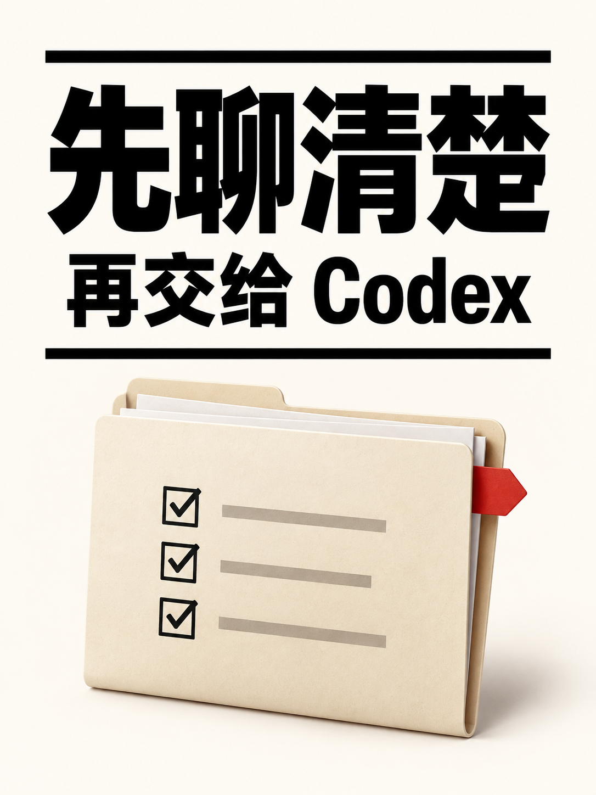
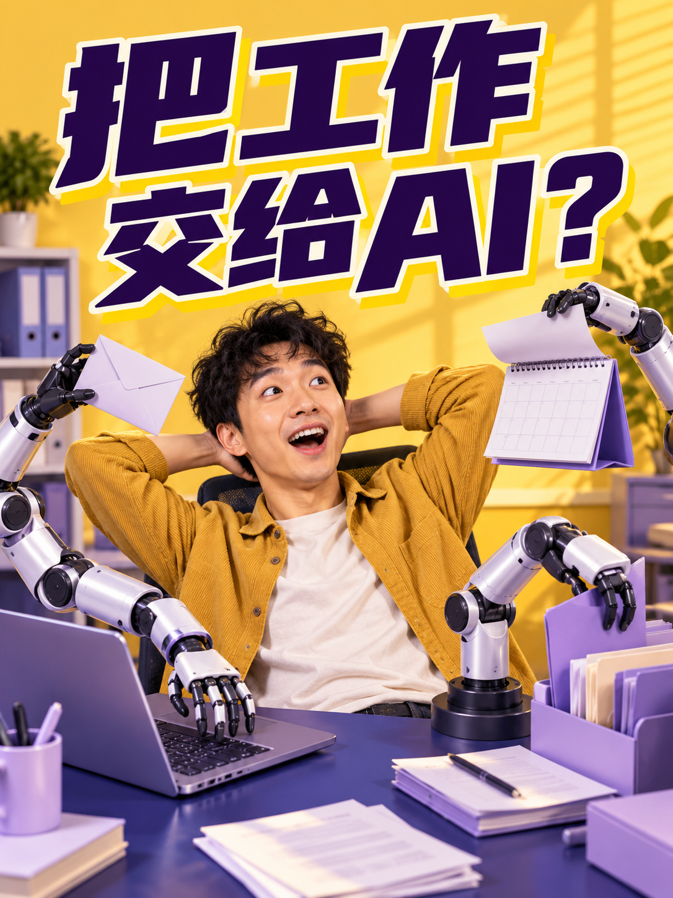

# Video CoverCraft · 视频封面工坊

根据视频脚本、视频描述或封面描述制作封面与完整提示词，支持常规或创意风格、参考图、中文标题、横竖画幅和可选人物；也可仅交付提示词、反推已有图或诊断旧封面。

A video-cover skill for AI agents. Turn a script, video summary, or visual brief into a cover and a portable prompt. Choose regular or creative styles, request prompts only, describe an existing cover, or diagnose and redesign it. Supports reference images, exact Chinese headlines, landscape/portrait layouts, and optional people.

当前版本 **2.11.0**。

## 常规风格与创意风格

| 创作方式 | 如何设计 | 如何检查 |
| --- | --- | --- |
| **常规风格** | 借鉴 AI 博主的主题表达、信息层级和主体尺度；字体、颜色、材质按内容调整 | 核对选取的表达特征、用户明确保留项与本期内容 |
| **创意风格** | 从表达结构延展，或从内容探索新构图与主体比喻；重新设计字体、配色和材质 | 按本轮设计目标和锁定项检查，允许变化的外观可以偏离旧样图 |

未指定时采用常规风格。创意延展与探索由 Agent 按意图判断，不新增必须回答的问题；两种方式都支持生成图片或只交付提示词。B01–B10 和旧风格名称继续可用，十张样图是设计起点。

说「这些风格全部不喜欢」时，会退出当前推荐，从内容重新构思，沿用已确定的文案、画幅、人物与必要素材，避开本轮拒绝项。只要一张仍只做一套；只要求改字体、颜色或字号时，按对应范围调整。用户明确限定常规风格时，继续在常规范围重选结构。反馈只有在用户明确要求长期记住时才保存为账号偏好。

无论采用哪种方式，实际生图后仍检查内容、逐字中文、人物、画幅和小图可读性。创意探索可以不使用旧风格图；需要保留真实人物身份、准确产品或软件界面时，仍须提供对应素材。详见 [创作方式与反馈处理](video-cover-craft/references/creation-modes.md)。

```text
$video-cover-craft
视频描述：用 AI 把零散会议记录整理成行动清单。
封面主标题逐字写「开完会，谁来做？」。
请用创意风格，重新设计构图、字体和材质。
横版 16:9，无人物，只要一套完整提示词，风格你决定。
```

## 图片、提示词与旧图诊断

普通「做封面」默认交付图片及对应的完整可移植提示词；「只要提示词」直接交付文字，不调用生图或 API。普通风格参考会展开为具体描述，复制到其他生图 AI 时无需附带技能图库；必须保留真实身份或精确界面时会列出必要素材。跨模型可能改变排版、中文准确性和细节，不保证逐像素复现。

「反推这张图的提示词」根据实际图片写近似复现描述；「诊断这张封面」给设计评审、修改顺序和完整改版提示词，默认不生图。明确要求重做时再生成改版。视频标题与封面文字分开记录，指定文案逐字采用，没有视频标题仍可继续。

[提示词交付](video-cover-craft/references/prompt-export.md) · [旧封面诊断](video-cover-craft/references/cover-diagnosis.md) · [标题与封面配合](video-cover-craft/references/title-cover-alignment.md)

## 先看图，再选风格

不知道风格长什么样，可以先打开 [十种风格的图文菜单](video-cover-craft/references/style-menu.md)。下载完整技能后，也可打开 [离线风格图库](video-cover-craft/style-picker.html)：按内容类型搜索，点选卡片，复制一条短句发给 Agent。

常规制作未选风格时，Skill 按主题先展示最多三种真实样图，并提供全部十种入口、「你帮我决定」与创意入口。离线菜单加入「常规风格」「创意风格」「这些都不喜欢 · 探索新方向」，点击后复制选择句发给 Agent。已要求创意探索或全部不满意时不重复打开原菜单；仅提示词可自主选风格。已有风格或参考不重复问；明确要求先看再选时等待选择。每种风格都可用横竖版、有人物或无人物，样图不限制本期设置。

例如：`先给我看看适合 AI 编程教程的风格，我选完再生成。` 看过后回复：`B02，竖版，无人物。` 只想浏览风格，不必先准备完整视频脚本。

## 真实 AI 生图案例

本页共展示 **26 张实际生成的 AI 主题封面**，可点击查看 PNG 原图。其中 10 张对应全部 10 种基础风格：5 张原创人物、5 张无人物，横竖各 5 张；其余 16 张也保留。主题为虚构案例，界面、论文、修复结果与模型回答均为示意。2.11.0 更新创作路线与规则，本次没有新增生图样张。

### 10 种基础风格的真实样张

[可筛选图库与提示词](examples/integrated-styles-v3/README.md) · [逐张来源与验图](video-cover-craft/references/style-validation.md)

#### 竖版 · 3:4

| B01 黄蓝冲击 | B03 白橙清单 | B05 极简编辑 |
| --- | --- | --- |
| <a href="video-cover-craft/assets/style-examples/01-b01-ai-weekly.png"></a> | <a href="video-cover-craft/assets/style-examples/03-b03-ai-paper.png"></a> | <a href="video-cover-craft/assets/style-examples/05-b05-ai-handoff.png"></a> |

| B08 未来办公 | B10 立体概念 |
| --- | --- |
| <a href="video-cover-craft/assets/style-examples/08-b08-ai-office.png"></a> | <a href="video-cover-craft/assets/style-examples/10-b10-ai-knowledge.png"></a> |

#### 横版 · 约 16:9

| B02 蓝黑科技 | B04 彩色漫画 | B06 发布会实测 |
| --- | --- | --- |
| <a href="video-cover-craft/assets/style-examples/02-b02-ai-editing.png"></a> | <a href="video-cover-craft/assets/style-examples/04-b04-ai-prompt.png"></a> | <a href="video-cover-craft/assets/style-examples/06-b06-ai-coding.png"></a> |

| B07 双阵营对比 | B09 矩阵控制室 |
| --- | --- |
| <a href="video-cover-craft/assets/style-examples/07-b07-ai-models.png"></a> | <a href="video-cover-craft/assets/style-examples/09-b09-ai-agents.png"></a> |

10 张样图的原图与 320px 小图检查记录见上述链接。30 个分支完成来源与设计规则整合，其中 10 个分支有实图验证；其余 20 个尚未逐个生图。2.11.0 的常规、创意、整体拒绝后探索及局部反馈流程完成了文本场景检查，尚未额外生图验证创意效果。

### 此前的 AI 主题案例

### 横版 · 16:9

| AI 做 PPT · B08 未来办公 | AI 编程 · B06 发布会实测 | AI 多模型对比 · B07 双阵营对比 |
| --- | --- | --- |
| <a href="examples/ai-topics-v2/images/02-ai-ppt.png"></a> | <a href="examples/ai-topics-v2/images/05-ai-code.png"></a> | <a href="examples/ai-topics-v2/images/06-ai-models.png"></a> |
| 无人物 | 原创虚拟人物 | 无人物 |

### 竖版 · 3:4

| AI 办公挑战 · B01 黄蓝冲击 | AI 读论文 · B03 白橙清单 | AI 修复照片 · B10 立体概念 |
| --- | --- | --- |
| <a href="examples/ai-topics-v2/images/01-ai-office.png"></a> | <a href="examples/ai-topics-v2/images/03-ai-paper.png"></a> | <a href="examples/ai-topics-v2/images/04-ai-restore.png"></a> |
| 原创虚拟人物 | 原创虚拟人物 | 无人物 |

[查看六个选题、设计依据和实际提示词](examples/ai-topics-v2/README.md)。这六个案例展示了六种风格，完整基础风格库共 10 种；上方新样张覆盖全部 10 类，30 个分支不代表均已实测。

### 更多 AI 风格案例

以下 6 张为此前生成的 AI 工作搭档、资料整理、知识库及 AI 开发流程案例，包含原创虚拟人物与无人物版本。标注的风格名称用于说明本张视觉方向；参考延展不另计为基础风格。

| AI 工作搭档 · 黄蓝冲击 | AI 知识库 · 彩色漫画 | ChatGPT → Codex · 冷暖接力 |
| --- | --- | --- |
| <a href="examples/images/01-yellow-blue-presenter.png"></a> | <a href="examples/images/04-color-comic-no-person.png"></a> | <a href="examples/images/06-cold-warm-presenter.png"></a> |
| 横版 · 原创人物 | 横版 · 无人物 | 横版 · 原创人物 |

| AI 开发流程 · 蓝黑科技 | AI 资料整理 · 白橙清单 | AI 开发需求 · 极简编辑 |
| --- | --- | --- |
| <a href="examples/images/02-blue-tech-no-person.png"></a> | <a href="examples/images/03-white-orange-presenter.png"></a> | <a href="examples/images/05-minimal-no-person.png"></a> |
| 竖版 · 无人物 | 竖版 · 原创人物 | 竖版 · 无人物 |

[查看这组案例的内容与生成提示词](examples/README.md)。

### Codex 额度主题 · 四种视觉方案

同一主题采用深蓝设备工作流、冷暖接力、清爽任务清单与漫画对照。均为无人物竖版；冷暖接力采用修改后的副标题「省额度小技巧」。

| 蓝黑科技 · 先讨论再开发 | 冷暖接力 · 省额度小技巧 |
| --- | --- |
| <a href="examples/codex-quota/images/01-blue-workflow.png"></a> | <a href="examples/codex-quota/images/02-cold-warm-quota-tip.png"></a> |

| 清爽清单 · 开发说明 | 彩色漫画 · 两种开发方式 |
| --- | --- |
| <a href="examples/codex-quota/images/03-clean-checklist.png"></a> | <a href="examples/codex-quota/images/04-comic-comparison.png"></a> |

[查看四张原图与实际提示词](examples/codex-quota/README.md)。

## 能做什么

- **三种输入任选一种**：完整脚本、视频内容简介，或直接描述想要的封面画面；也可以组合。
- **参考图与风格延展**：10 种 AI 基础风格、30 个基础分支、31 个原参考档案；配色可按内容自由变化。
- **常规与创意路线**：按用户意图选择结构延展或内容探索；全部不喜欢时重新构思，保留已确定设置。
- **完整可移植提示词**：默认逐图交付，也可只要提示词或基于已有图提词；普通风格描述不依赖图库附件。
- **旧图诊断与改版**：查看实际图片，给设计评审和修改顺序；用户要求改图时再生成。
- **先确认画幅与人物**：只补问尚未明确的选择，不要求本人出镜。
- **GPT Image 优先**：不可用时使用平台自带生图工具；也支持用户自行配置并明确选用 OpenAI 图片 API。
- **输出与检查**：实际图片、PNG/JPEG 导出、缩略图、列表预览，以及中文文字核对与设计依据。
- **按本轮目标验收**：区分锁定、继承和重新设计项，结合内容与标题检查；仅提示词不冒称像素验收通过。

Skill 的完整入口在 [video-cover-craft/SKILL.md](video-cover-craft/SKILL.md)，使用条件和工具能力以宿主提供的实际工具为准。

## 10 种 AI 基础风格

| 编号 / 名称 | 独立的视觉结构 | 适用的 AI 内容 | 配色与标题起点 |
| --- | --- | --- | --- |
| B01 黄蓝冲击 | 大字、强色块、单一夸张动作或对象 | AI 工具亮相、办公挑战、功能变化 | 黄蓝或柠檬紫墨；粗斜字与明确描边 |
| B02 蓝黑科技 | 深色设备空间、透视、重点光域与工作流 | AI 编程、软件教程、自动化 | 蓝黑青白或深绿暖金；白色粗标题 |
| B03 白橙清单 | 浅底、层次清楚的任务卡和功能图标 | AI 技能列表、论文整理、步骤说明 | 白橙或晨雾薄荷；黑色粗字、重点条 |
| B04 彩色漫画 | 漫画轮廓、分格、问题与解法或夸张比喻 | AI 误区、功能讲解、模型概念 | 有限明亮色块；漫画轮廓字 |
| B05 极简编辑 | 大留白、单一 AI 工具或成果、一句观点 | AI 经验复盘、提示词、方法观点 | 中性色与一个重点色；编辑式标题 |
| B06 发布会实测 | 摄影工作室、主展示对象、体验或问答标题 | AI 新功能体验、工具评测、发布解读 | 炭黑暖金或灰蓝银白；粗斜标题与一处版本重点 |
| B07 双阵营对比 | 同等视觉重量的两区、共同任务与比较对象 | 两模型、两工具、两种 AI 做法的对比 | 冷暖或两套可区分色；两方名与一个主问题 |
| B08 未来办公 | 统一空间内的环幕、悬浮设备、成果舞台 | AI 办公、PPT、文档、Agent 协作 | 蓝紫云白或薄荷银灰；宽块字与少量任务标签 |
| B09 矩阵控制室 | 重复任务格阵、一个被强调的活动单元、控制台 | 多 Agent 调度、批处理、排错与知识库 | 深墨青电光或紫青；短大字，重点格最亮 |
| B10 立体概念 | 一个大 3D 概念物、剖面或尺度差解释关系 | AI 能力、Token、检索、图像修复和系统原理 | 白底黄黑或深靛珊瑚；重字与清楚对象轮廓 |


默认示例围绕 AI 工具、办公、编程、模型对比、Agent 与图像能力。每种风格均支持有人物、无人物及横竖版。表中的字体、配色、质感和结构是具体起点，用户未锁定时可变化；创意探索可不选 B 分支。每个分支已补齐来源、变化对象、人物/画幅适配与验收重点；10 类各有一张真实样张，不表示 30 个分支均已实测。

## 20 位 AI 创作者的封面调研

实际查看 **41 张不同视频的封面**，覆盖 **YouTube 14 位、哔哩哔哩 6 位**。按创作者账号去重，逐位记录标题层级、配色、主视觉、人物与无人物的做法，并转成适用于 AI 选题的设计规则。

| 平台 | 已研究的创作者账号 |
| --- | --- |
| YouTube · 14 位 | Matt Wolfe、The AI Advantage、Wes Roth、Matthew Berman、1littlecoder、Skill Leap AI、TheAIGRID、AI Search、AI Explained、MattVidPro、Futurepedia、Goda Go、Two Minute Papers、AI Samson |
| 哔哩哔哩 · 6 位 | AI超元域、秋芝2046、技术爬爬虾、人工大黑、AI产品狙击手、码里奥Ziho |

[查看每位的原视频、看图观察与延展](video-cover-craft/references/ai-creator-cover-research.md) · [按内容选择结构与六组配色](video-cover-craft/references/ai-cover-patterns.md) · [完整来源记录](video-cover-craft/references/ai-creator-cover-sources.json)

观察样本与设计建议分开记录；不把参考博主的脸、标题和未核实结论带进新封面。网上原封面仅用于调研，公开包保留来源与观察。本页 26 张案例均为本项目实际生成的图片，网上博主原封面未重新分发。

## 安装

下载本仓库后进入 `video-cover-craft` 文件夹：

```bash
python3 scripts/install_skill.py --target codex
```

默认安装到 Codex 的用户技能目录；已有同名技能时，加 `--replace` 可先备份再替换。其他支持 Skill 的 Agent 平台请按其方式导入整个 `video-cover-craft` 文件夹，保留参考文档、图片和脚本。

API 是可选路径，配置说明见 [OpenAI 图片 API](video-cover-craft/references/openai-api-setup.md)。不需要把 API Key 写入仓库。公共版本不包含个人偏好记录；安装后只有你明确要求长期沿用时才保存设置。


旧名升级：如果此前安装为 `cover-craft` 或 `cover-studio`，先把旧技能文件夹改名为 `video-cover-craft`，再运行本版安装助手并加 `--replace`；安装助手会备份旧版并保留 `user-preferences.json`。同一技能只保留一个安装入口。

## 使用

```text
$video-cover-craft

视频描述：教大家先在 ChatGPT 讨论开发需求，整理开发说明，再交给 Codex 实现。
做一张竖版 3:4，无人物。
没有标题，请帮我拟写；参考内置 R12-02 的冷暖分区，改成两工具接力。
只做一张，配色你决定。
```

也可以直接提供画面要求：

```text
$video-cover-craft

封面描述：深青书房背景，暖橙光照着右下方笔记本电脑。
左侧聊天面板，中央开发说明，发光箭头连接到电脑。
上方主标题逐字采用“Codex额度用太快？”，副标题“省额度小技巧”。
竖版 3:4，无人物，生成一张。
```

[完整说明](video-cover-craft/README.md) · [更多调用示例](video-cover-craft/references/examples.md) · [基础风格目录](video-cover-craft/references/style-catalog.md)

默认生成的是扁平图片，中文文字和参考素材需要验图；可编辑文字层是可选额外流程。实际生图模型由工具或所选 API 决定，未知型号不会被标成 GPT Image。
