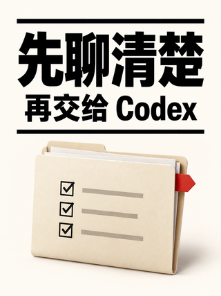
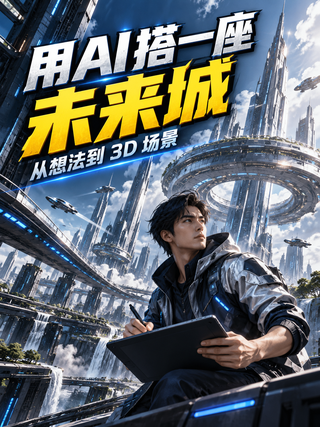
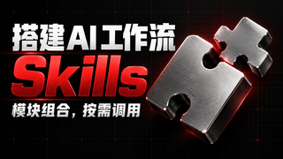
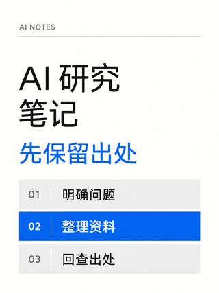

# 看图选风格

向不知道风格长什么样的用户展示真实样图，帮助选择视觉方向。这是生图前的浏览功能，不调用图片模型，不要求完整脚本或先回答画幅/人物才能看图。

菜单同时提供「常规风格」「创意风格」与「这些都不喜欢，探索新方向」。常规用已有样图帮助选择；创意包含延展与探索，按 [creation-modes.md](creation-modes.md) 自主判断内部策略，不让用户再选子模式。图库只有已有真实样张，不能将创意入口称为新增实图。

## 展示时机与选择流程

- 新制作未说明基础/创意时先按 [creation-modes.md](creation-modes.md) 澄清；只有创作方式缺失时问这一项，不为提问强制打开图库。用户要求先看样图时，可在展示推荐的同一轮提供基础/创意选项，选择 B 样图视为基础，选择创意进入新设计，不拆成两轮。
- 已选择基础方式、但未选具体风格或明确参考时，可按主题展示最多三种推荐：**B/S 编号、名称、真实样图、一句适用理由**，附完整图库入口和「你帮我决定」。具体 B/S 编号不作为额外必答项；用户已要直接制作时采用推荐继续。
- 已要求创意探索或全部不满意时，退出原菜单，从内容设计新方向；若用户明确限定常规则按其范围重选结构；明确要求先看方案才先给提案并等待选择，已授权直接做时继续，不自动增加张数或重问已明确设置。
- 用户明确说「先看看」「让我选」「不知道风格是什么」时，先展示图片，等待选择风格或授权自主选择，再生成；缺少主题时可直接展示完整图库，不编造针对本期的推荐。
- 用户已明确指定内置风格、要求沿用原风格或授权自主决定时不重复要求选菜单。单给参考图不会自动回答基础/创意，澄清方式后仍无需重新选菜单。画幅、人物和创作方式已清楚、用户要直接制作时继续，不强制再选具体 B/S 编号。
- 只要求看风格时，展示完即可，不生图，不索取视频脚本、自拍、画幅或创作方式。用户只选风格但尚未提供主题时也先接受选择，真正制作时再补足实际缺项。
- 接受 B02、02、编号 2、蓝黑科技等明确指向同一条目的说法；「第二张」按本轮展示顺序解释，不能误认为一定是 B02。也接受 S07、黑网格黄白巨字等特定风格编号/名称；只有裸数字“7”仍按当前展示顺序或已有B规则解释，不能静默改为S07。记录展示顺序与选中的 B/S 编号；含糊且影响结果时再补问。
- 不让新用户选择 30 个内部构图分支。先选基础风格，Agent 依据主题选分支；用户想看进阶选项时再读取 [style-catalog.md](style-catalog.md)。

用户可以直接回复：`B02，竖版，无人物。` 或 `风格你决定，横版，有人物，用原创角色。` 风格选择不自动保存为长期偏好，只有明确要求长期沿用时才保存。

## 怎样把图片展示给用户

1. **聊天图片卡片**：读取 [菜单数据](../assets/style-menu.json) 与 [样张索引](../assets/style-examples/manifest.json)，找到真实缩略图。宿主支持本地图片时，解析为当前安装目录的绝对路径后内联展示，并链接原 PNG。B/S 项都通过 `example_id` 找到独立生成样图；S 项的 `reference_asset` 与 `reference_region_xyxy` 只用于追溯风格来源，不能把来源截图当成本期生成图。不要使用开发者电脑的固定路径；不同 Agent 的安装目录不同。
2. **完整图库**：打开或提供技能根目录的 [style-picker.html](../style-picker.html)。它不用联网，支持按内容类型/关键词浏览，点击卡片生成一条可复制的选择句。它不会自动把选择发送到 Agent；用户将短句粘贴回聊天。
3. **无法显示本地图片时**：若宿主允许展示公开网络图片，B/S 项都使用 `style-menu.json` 中的 `remote_image_base` 加实际样图文件名；需要查原参考时再用 `remote_asset_base` 加 `reference_asset`；或提供 [GitHub 图文菜单](https://github.com/klosexf/CoverCraft-skill/blob/main/video-cover-craft/references/style-menu.md)。网络图片也无法展示时提供可打开的图库/PNG 链接与名称描述，说明本轮没有显示图片，不声称用户已经看过预览。

本页下方图片使用包内的相对链接，能在 GitHub 和支持相对资源的 Markdown 阅读器显示；Agent 发给聊天时要按宿主转换。GitHub 不会把 HTML 文件页直接运行成网站，在线浏览优先用 Markdown 图文菜单；下载完整技能后才能打开离线 HTML。

目前可选18项，每项都有一张真实生成样图：10种B基础风格、8种S截图特定风格。S项直接读[特定规格](screenshot-specific-styles.md)，不强制再选B风格或构图分支。每种风格目前有一张菜单主样图。**18种都支持横/竖版、有人物/无人物，样图的设置不是风格限制。** 不按用户要求的画幅或人物去隐藏其余风格，也不为了看菜单重新生成图片。明确采用某图为生图参考时，再查看并实际传入 PNG，不能只给文字档案。

## 按主题推荐的起点

| 用户的视频内容 | 可展示的三种方向 | 如何说明区别 |
| --- | --- | --- |
| AI 编程、自动化、软件操作 | B02、B06、B05 | 工作流 / 实物体验 / 简洁方法 |
| AI 办公、文档、论文 | B03、B08、B01 | 功能卡 / 协作空间 / 大字冲击 |
| 两模型或两种方法比较 | B07、B04、B05 | 同题两区 / 比喻 / 观点 |
| Agent 协作、分工、批任务 | B09、B08、B02 | 格阵调度 / 少量模块 / 接力流程 |
| AI 原理、知识库、Token | B10、B04、B05 | 器物剖面 / 漫画比喻 / 极简观点 |
| 新功能、产品资讯 | B06、B01、B10 | 体验展示 / 强标题 / 立体主物 |

这只是推荐起点。用户要求或参考优先；根据具体主题说明理由，不把一个内容类别锁成一种风格，不把推荐说成点击率排名。配色可以变化。

## 十种基础风格 B01–B10

| 编号 / 名称 | 真实样图（点击看原图） | 长什么样 / 适合什么 |
| --- | --- | --- |
| **B01 黄蓝冲击** | [](../assets/style-examples/01-b01-ai-weekly.png) | 大字、强色块，突出一个工具或成果<br>适合：AI 工具亮相、AI 办公挑战 |
| **B02 蓝黑科技** | [](../assets/style-examples/02-b02-ai-editing.png) | 深色设备、重点光线，把操作关系画清楚<br>适合：AI 编程、自动剪辑、自动化教程 |
| **B03 白橙清单** | [](../assets/style-examples/03-b03-ai-paper.png) | 浅色背景、功能卡片，清楚又容易读<br>适合：Skill 功能列表、AI 读论文、步骤说明 |
| **B04 彩色漫画** | [](../assets/style-examples/04-b04-ai-prompt.png) | 粗轮廓、漫画比喻，直观解释问题与解法<br>适合：提示词技巧、AI 使用误区、模型概念 |
| **B05 极简编辑** | [](../assets/style-examples/05-b05-ai-handoff.png) | 大留白、少量对象，让一句观点成为主角<br>适合：AI 使用心得、开发方法、研究观点 |
| **B06 发布会实测** | [](../assets/style-examples/06-b06-ai-coding.png) | 摄影工作室、具体展示对象，强调体验感<br>适合：AI 产品体验、AI 编程实测、新功能解读 |
| **B07 双阵营对比** | [](../assets/style-examples/07-b07-ai-models.png) | 两方同样清楚，用共同任务比较做法<br>适合：两模型对比、两工具比较、前后方法 |
| **B08 未来办公** | [](../assets/style-examples/08-b08-ai-office.png) | 统一办公空间、少量任务模块，展示协作<br>适合：AI 办公、文档与 PPT、多工具接力 |
| **B09 矩阵控制室** | [](../assets/style-examples/09-b09-ai-agents.png) | 重复任务格阵、一个焦点，突出调度关系<br>适合：多 Agent 调度、批处理、任务排错 |
| **B10 立体概念** | [](../assets/style-examples/10-b10-ai-knowledge.png) | 大立体器物或剖面，让抽象关系看得见<br>适合：AI 知识库、检索原理、Token 概念 |

这些都是实际生成的图片，界面和主题为示意；样图中人物为原创角色。每种三个延展分支，共 30 个；其中 10 个有本版实图，另 20 个仅完成规则。详细来源与检查见 [style-validation.md](style-validation.md)。

## 为本期生成带推荐标记的菜单

需要独立预览页且宿主能运行本地脚本时，可使用 `scripts/preview_styles.py`；图片路径自动从技能安装位置解析。示例命令在技能根目录执行：

```bash
python3 scripts/preview_styles.py --out /absolute/path/to/new-style-menu.html --recommend B02 B06 B05
```

脚本仅组织已有图片，没有生图开销，最多标记三个推荐，不替代 Agent 理解脚本。输出已存在时不会覆盖，换一个新路径。离线页面引用当前技能资源，单独复制 HTML 而不保留图片路径会失效；分享时可使用随包图库、完整技能或公共图文菜单。

## 截图特定风格 S01–S08

来自用户本轮 R14 原截图，按可见封面归并为 8 类。可直接说编号或名称，完整结构、配色、字形、主体、横竖版、人物与风格片段见 [特定风格规格](screenshot-specific-styles.md)。仍最多推荐三项，不要求用户选额外分支。

| 编号 / 名称 | 识别特征 | 原图依据 |
| --- | --- | --- |
| [S01 蓝黑界面实战](screenshot-specific-styles.md#s01) | 上部白青大标题，下部发光设备与一个清楚的界面成果 | R14-01、R14-06 |
| [S02 斜切动势海报](screenshot-specific-styles.md#s02) | 倾斜重字、冷色场景与大动作主体形成一条斜向视线 | R14-02 |
| [S03 黑红金属拼块](screenshot-specific-styles.md#s03) | 黑底白红重字，银色拼块与红色边光表达模块组合 | R14-03 |
| [S04 瑞士白底文档](screenshot-specific-styles.md#s04) | 白底留白、细线与编号表，蓝色重点行组织一条观点 | R14-04 |
| [S05 紫晶软件入门](screenshot-specific-styles.md#s05) | 上部一枚紫色晶体标识，下部白色斜体入门大字 | R14-05 |
| [S06 蓝紫产品面板](screenshot-specific-styles.md#s06) | 亮蓝紫底、大产品名与一个主功能窗口，短标签讲清用途 | R14-07 |
| [S07 黑网格黄白巨字](screenshot-specific-styles.md#s07) | 弱网格黑底，居中黄白粗斜字，以文字承担全部焦点 | R14-08、R14-10 |
| [S08 黑金成果聚焦](screenshot-specific-styles.md#s08) | 深黑底、一个金色大物件，短白字围绕成果建立焦点 | R14-09 |

S 风格从已有截图提炼；2.17.0 为每项补充一张独立生成的 AI 主题样图。菜单默认展示新样图，来源截图与区域记录保留供查证。准确身份/界面与原文案不会因选同一风格而继承。

### 8 张 AI 主题样图 · 2.17.0

横版与竖版各 4 张；S01、S02 使用原创人物，其余 6 张无人物。主题是虚构教学案例，软件界面与产品模型均为示意。每张都单独生成，并检查了原图和 320px 小图。

| 风格 | 实际生成样图（点击原图） | 主题与设置 | 完整提示词 |
| --- | --- | --- | --- |
| **S01 蓝黑界面实战** | [](../assets/style-examples/11-s01-ai-coding.png) | AI 编程实战<br>16:9 · 原创人物 | [复制提示词](../assets/style-examples/prompts/11-s01-ai-coding-portable.txt) |
| **S02 斜切动势海报** | [](../assets/style-examples/12-s02-ai-city.png) | 用 AI 搭一座未来城<br>3:4 · 原创人物 | [复制提示词](../assets/style-examples/prompts/12-s02-ai-city-portable.txt) |
| **S03 黑红金属拼块** | [](../assets/style-examples/13-s03-ai-skills.png) | 搭建 AI 工作流<br>16:9 · 无人物 | [复制提示词](../assets/style-examples/prompts/13-s03-ai-skills-portable.txt) |
| **S04 瑞士白底文档** | [](../assets/style-examples/14-s04-ai-research.png) | AI 研究笔记<br>3:4 · 无人物 | [复制提示词](../assets/style-examples/prompts/14-s04-ai-research-portable.txt) |
| **S05 紫晶软件入门** | [](../assets/style-examples/15-s05-ai-knowledge.png) | AI 知识库入门指南<br>3:4 · 无人物 | [复制提示词](../assets/style-examples/prompts/15-s05-ai-knowledge-portable.txt) |
| **S06 蓝紫产品面板** | [](../assets/style-examples/16-s06-ai-workbench.png) | AI 工作台<br>16:9 · 无人物 | [复制提示词](../assets/style-examples/prompts/16-s06-ai-workbench-portable.txt) |
| **S07 黑网格黄白巨字** | [](../assets/style-examples/17-s07-ai-brief.png) | 用好 AI 先说清需求<br>3:4 · 无人物 | [复制提示词](../assets/style-examples/prompts/17-s07-ai-brief-portable.txt) |
| **S08 黑金成果聚焦** | [](../assets/style-examples/18-s08-ai-product.png) | AI 产品设计<br>16:9 · 无人物 | [复制提示词](../assets/style-examples/prompts/18-s08-ai-product-portable.txt) |
